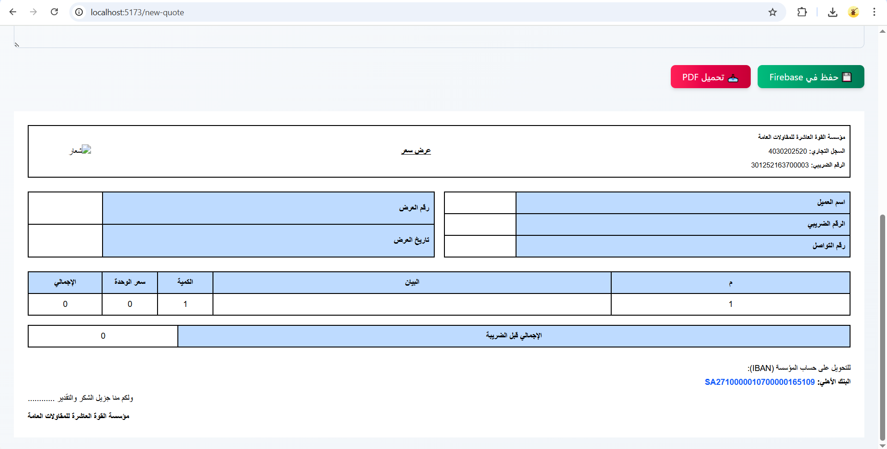
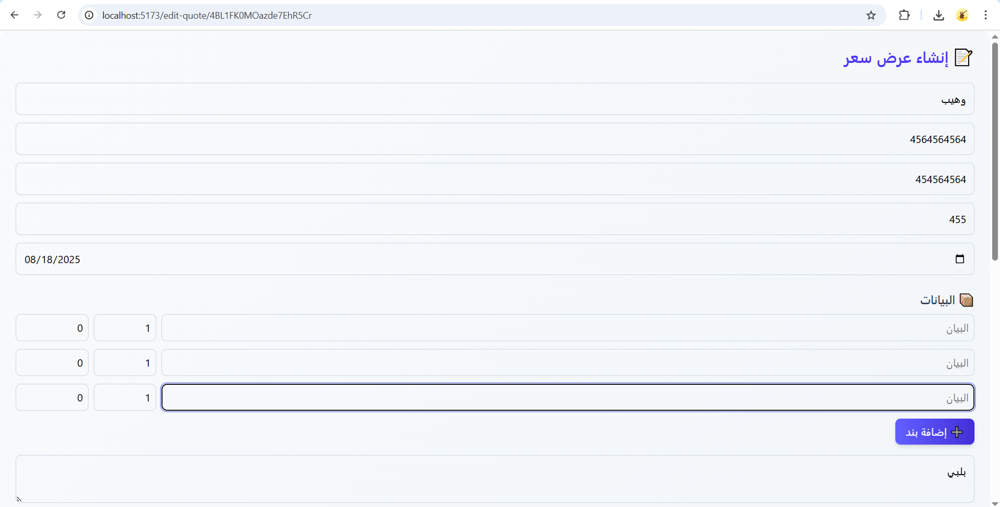
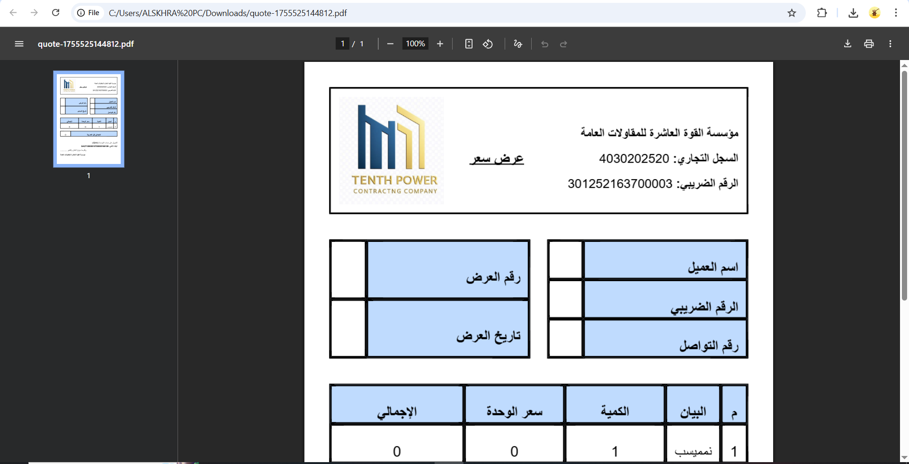

````markdown
# Quotes & Reports Management App

A professional **React** application for creating, editing, and managing quotes and reports. This project allows users to:

- Create new quotes with customer information and itemized lists.  
- Automatically calculate totals, VAT, and subtotals.  
- Edit and update existing quotes stored in **Firebase Firestore**.  
- Generate PDF versions of quotes for download.  
- Search quotes by customer name and sort by creation date.  
- Attach and manage files using **Firebase Storage**.  

---
## Features
- ✅ Add, edit, and delete quotes.  
- ✅ Dynamic calculation of totals and VAT.  
- ✅ Save all data securely in Firebase.  
- ✅ Generate PDF reports with a click.  
- ✅ Search and filter quotes by customer name or date.  
- ✅ RTL (Right-to-Left) support for Arabic text.  

---
## Screenshots

### Dashboard / Main Page


### Create Quote


### Edit Quote


### Generated PDF


> Replace the links above (`screenshots/...`) with your actual screenshot paths.

---

## Tech Stack

- **React.js** – Frontend  
- **Firebase Firestore** – Database  
- **Firebase Storage** – File uploads  
- **jsPDF & html2canvas** – PDF generation  
- **Tailwind CSS** – Styling  

---

## Installation

1. Clone the repository:

```bash
git clone git@github.com:YourUsername/quotes-app.git
````

2. Install dependencies:

```bash
cd quotes-app
pnpm install
```

3. Configure Firebase:

* Add your Firebase config in `firebaseConfig.js`.

4. Run the project:

```bash
pnpm run dev 
```

---

## Usage

* Navigate to the **Create Quote** page to add new quotes.
* Use the **Quotes List** page to view, edit, or delete existing quotes.
* Click **Download PDF** to generate a professional quote report.

---

## License

This project is licensed under the MIT License.

---

## Author

– [GitHub Profile](https://github.com/waheeb71)

